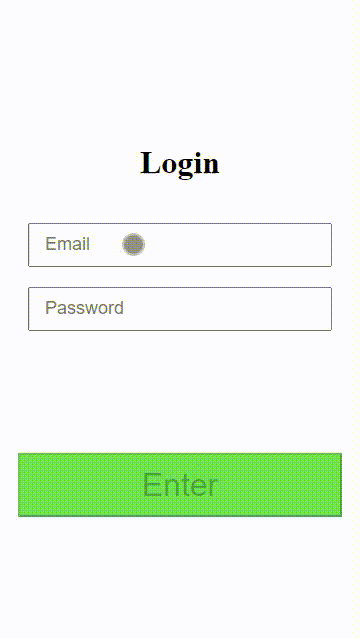
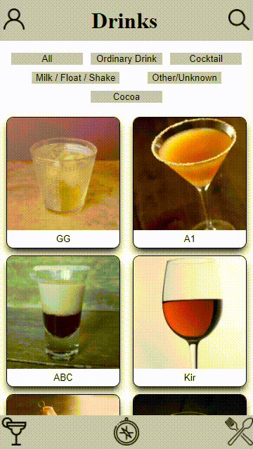
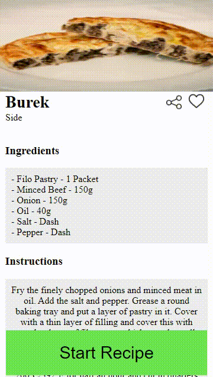
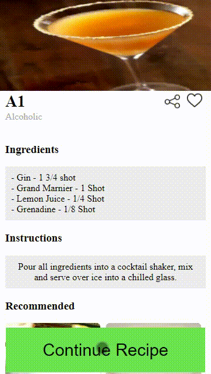

# Boas vindas ao repositório do projeto de Receitas!

Esse é um projeto que realizei em grupo com alguns colegas de turma na Trybe!

### Habilidades

Nesse projeto contém:

  - Context API do _React_ para gerenciar estado
  - _React Hook useState_
  - _React Hook useContext_
  - _React Hook useEffect_
  - Criar Hooks customizados
  - Validação de _PropsTypes_
#vqv 🚀

---

  

    
Tela de Login

      
  

  ---

  

    
Tela principal de receitas de Comida e Bebida

      
  

  ---

  

    
Tela de detalhes de uma receita - (Comida)

         
  

  ---

  

    
Tela de detalhes de uma receita - (Bebida)

         
  

  ---

  

    
Tela de receita em progresso - (Comida) 

      
  

  ---

  

    
Tela de receita em progresso - (Bedida) 

      
  

